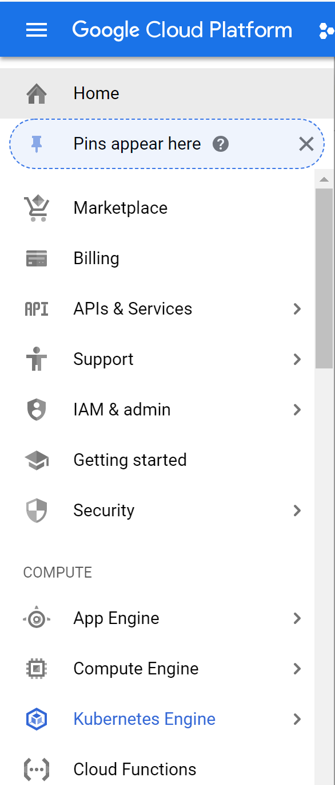

# ray-gibson
ray+gibson GCE K8 cluster

## Instructions

### Setting up a GCE K8 Cluster 
#### (web interface)

(***Note: upgraded GCE account needed to request more than 1 GPU)  
On your GCE console -> Kubernetes Engine -> Create Cluster -> GPU Accelerated Computing

<!-- -->
    

Please check the GPU availability on your cluster's zone.  
Links to more details on each zone's:  
* GPU availability: [here](https://cloud.google.com/compute/docs/gpus/).  
* resource quotas [here](https://console.cloud.google.com/iam-admin/quotas?_ga=2.117426756.-318237526.1538593068)

For example:  
choose `us-west1-b`; leave the `micro-pool-1` as is;  
setup `gpu-pool-1` with 1 `Node`: 4 `vCPUs`, `32 GB Memory`, 1 `NVIDIA Tesla P100`;  
in `Advanced edit` for `gpu-pool-1`: allocated 200`GB` for Boot Disk Size.

#### (command line)
[instructions](https://cloud.google.com/sdk/docs/quickstart-debian-ubuntu) on installing GCloud  
Setup your project with GCloud using `gcloud init`  
Start a single-node K8 cluster with:
```
gcloud container clusters create ray-gibson --num-nodes=1 --machine-type=custom-4-32768 --accelerator type=nvidia-tesla-p100,count=1 --disk-size=200 --zone us-west1-b --cluster-version 1.9
```
For more details, go to Google's [documentation on `gcloud container clusters create`](https://cloud.google.com/sdk/gcloud/reference/container/clusters/create)  
Your single `NVIDIA Tesla P100` `GPU` node will be under the `default-pool` of `ray-gibson` cluster.

### Installing NVIDIA Drivers
#### Using your own terminal
-----
If you are not using Google's Cloud Shell, you must first install GCloud SDK + `kubectl`.  Link to your project with `gcloud init`.  Finally, connect to your Kubernetes cluster by doing the following:  
* In [GCloud Console's Kubernetes Engine](https://console.cloud.google.com/kubernetes/), click the `connect` button  
* Paste the command displayed onto your local terminal

-----

Unlike setting up a normal compute instance, the base Image of nodes in a K8 cluster can only be Google's Container-Optimized OS or bare-basic Ubuntu.  
Google provides a K8 DaemonSet that installs GPU drivers on your cluster's nodes. As of writing, the [instruction on Google's Docs](https://cloud.google.com/kubernetes-engine/docs/how-to/gpus#installing_drivers) does not work. Use the following command instead:  
```
kubectl create -f https://raw.githubusercontent.com/GoogleCloudPlatform/container-engine-accelerators/k8s-1.9/nvidia-driver-installer/cos/daemonset-preloaded.yaml
```

Check that the installation DaemonSet is correctly running:
```
kubectl get daemonset -n=kube-system
```

### Starting Pods
To allocated GPU resources to a pod, simply specify under the container's resources in the `yaml` file. For example:  
```
resources:
    limits:
      nvidia.com/gpu: 1
```
This repo provides a sample `yaml` file in the `kube` directory that will start up a pod using our `ray-gibson` image.
```
cd kube
kubectl create -f head.yml
```

Run `nvidia-smi` to verify GPU driver is installed.
If the pod's bash cannot locate the `nvidia-smi` script, add the following to `LD_LIBRARY_PATH`:
```
export LD_LIBRARY_PATH=/usr/local/nvidia/lib64:/usr/local/nvidia/bin:$LD_LIBRARY_PATH
```
